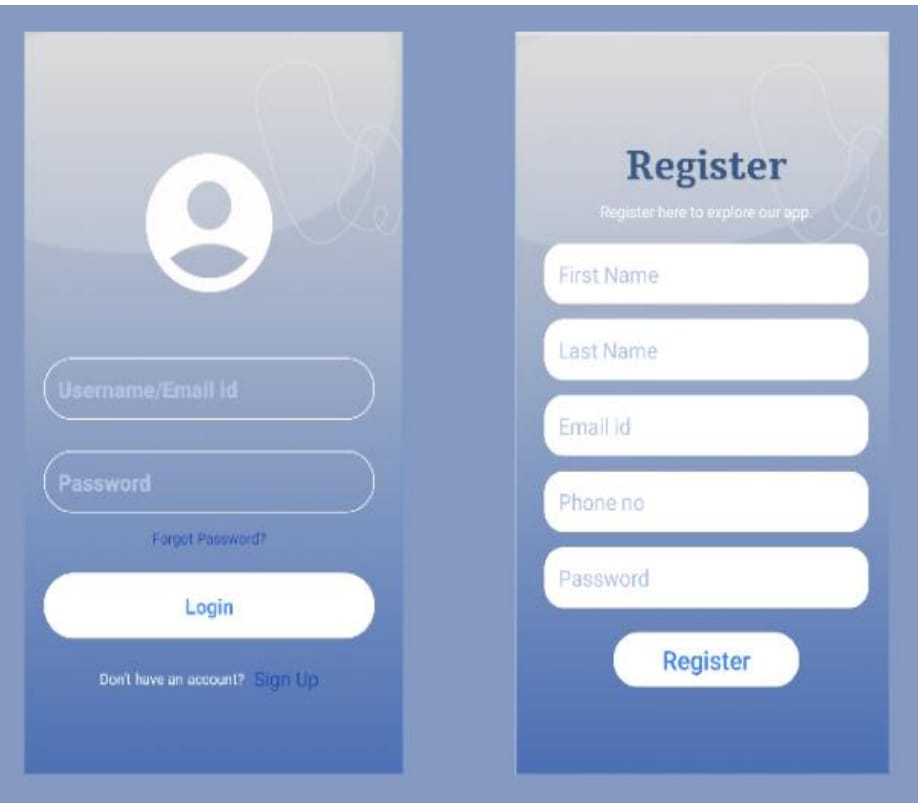
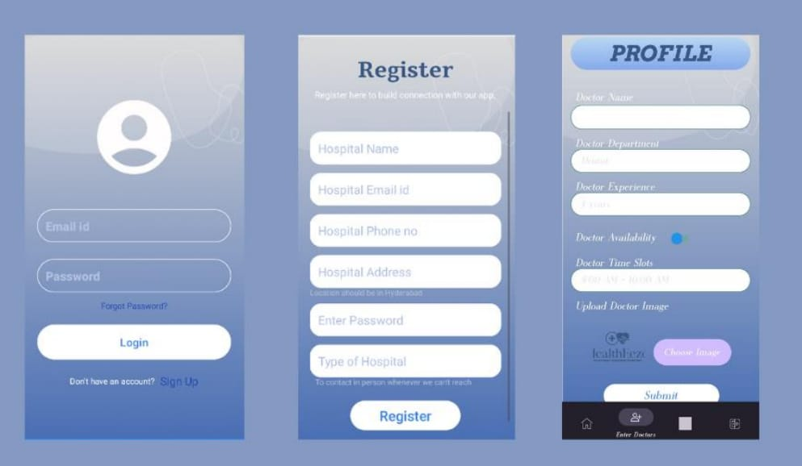
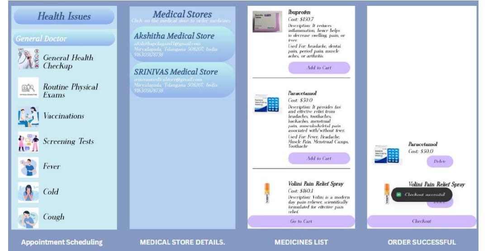
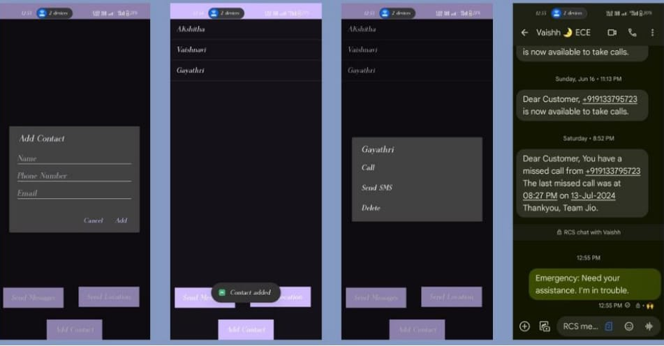
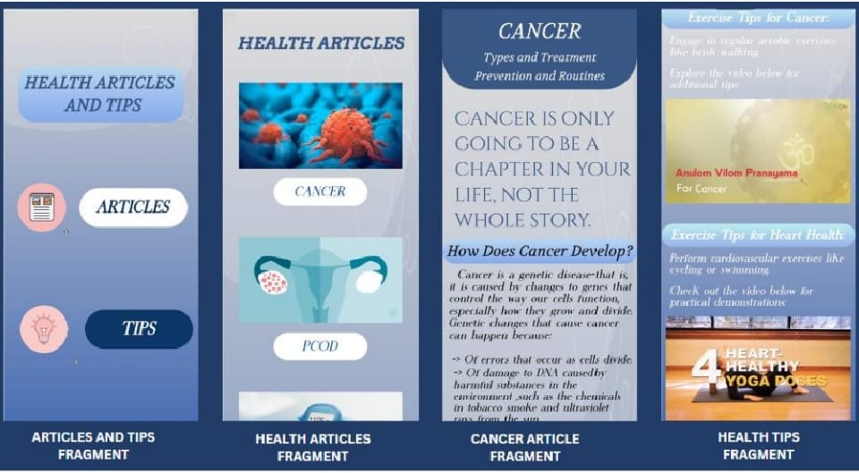
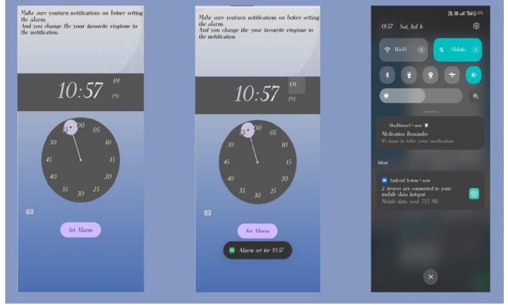

# HealthEeze-App
Comprehensive Healthcare Management App using Kotlin &amp; Firebase with appointment booking, medicine ordering, and smart reminders
# 🏥 HealthEeze – Comprehensive Health Companion

## 📌 Overview
HealthEeze is a full-stack Android healthcare management application designed to streamline medical services and improve user health outcomes. The app enables users to book appointments, order medicines, set medication reminders, and access health-related content in a single platform.

## 🚀 Key Features
- 📅 Appointment Booking with healthcare providers  
- 💊 Medicine Ordering from medical stores  
- ⏰ Smart Medication Reminders using Alarm Manager  
- 🏥 Hospital & Doctor Information System  
- 🚨 Emergency Contact Management  
- 📚 Health Tips & Educational Articles  
- 🔔 Real-time Notifications using Firebase Cloud Messaging  

## 🧠 System Architecture
The application follows a multi-layered architecture:
- *Frontend:* Android (Kotlin, XML)
- *Backend:* Firebase (Realtime Database, Authentication)
- *Integration:* APIs for notifications, email, and data sync

## 🛠 Tech Stack
- *Language:* Kotlin  
- *IDE:* Android Studio  
- *Database:* Firebase Realtime Database  
- *Authentication:* Firebase Auth  
- *Notifications:* Firebase Cloud Messaging (FCM)  
- *Storage:* Firebase Storage  
- *UI Design:* XML  
- *Other Tools:* Glide, Alarm Manager, Broadcast Receiver  

## 📊 Key Functional Modules
- User Authentication Module  
- Appointment Management System  
- Medicine Ordering System  
- Notification & Reminder System  
- Health Tips & Articles Module  
- Emergency Contact System  

## 📈 Impact
- Improved healthcare accessibility and user convenience  
- Enabled real-time data synchronization and communication  
- Enhanced medication adherence through automated reminders  

## 🔮 Future Enhancements
- AI-based health recommendations  
- Wearable device integration  
- Telemedicine features  
- Health insurance integration  

## 📷 Screenshots

  
  

  
  

  
  

## 📄 Documentation

  

  Detailed project documentation is available in the <b>/docs</b> folder.

## 👨‍💻 My Contribution
- Developed Android application features using Kotlin  
- Integrated Firebase Authentication and Realtime Database  
- Implemented medication reminder system using Alarm Manager  
- Designed UI and worked on module integration  

## 👩‍💻 Author
*Shaik Firdose*  
🔗 LinkedIn: https://www.linkedin.com/in/firdose-shaik-97273b258  
🔗 GitHub: https://github.com/Shaikfirdose12
